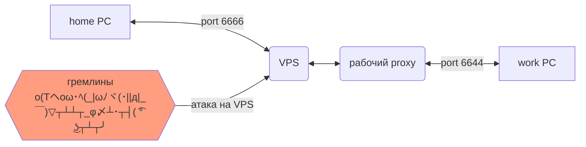

# ХопБит. или "Туда и обратно"

Инструкция для прокладки тоннеля между двумя ПК через внешний шлюз.  
Можно почитать man страницу ssh про флаги  -R -p, этого будет достаточно.  

Утилита `corkscrew` используется для обхода внутреннего файрволла.  
Так бывает, что админы и СБ перекрывают доступ в интернет, что подключиться по ssh к VPS по стандартному 22 порту ssh не получается.

Для защиты от гремлинов, рекомендуется настроить вход на сервер только по ssh ключу. Здесь это не описано.

## Действующие лица

карта мира:



- home PC
  - home_ip
  - home_user

- VPS
  - vps_ip
  - vps_user

- work PC
  - work_ip
  - work_user

- рандомный port 1 **[6666]**
- рандомный port 2 **[6644]**

## Краткая сводка на 1 экран

>### Тоннель от VPS к домашнему ПК
>
>1. открыть Remote на домашнем ПК. Процесс должен быть всегда открыт.  
>**home@**`ssh -R 6666:localhost:22  vps_user@vps_ip`
>
>2. подключиться к домашнему ПК с сервера  
>**vps@**`ssh -CX home_user@localhost -p 6666`
>
>### Подключиться с работы к VPS
>
>1. на рабочем ПК установить corkscrew  
>`https://github.com/bryanpkc/corkscrew`
>
>2. настроить конфиг файл ssh на рабочем ПК  
> заменить INTERNAL_PROXY_IP INTERNAL_PROXY_PORT на используемые в офисе
>
>```config
>host name_vps
>        HostName **vps_ip**
>        Port 443
>        User **vps_user**
>        ProxyCommand /usr/local/bin/corkscrew INTERNAL_PROXY_IP INTERNAL_PROXY_PORT %h %p
>host name_home
>        HostName localhost
>        User **home_user**
>        Port 6666
>        ProxyJump name_vps
>```
>
>3. подключиться к серверу с работы  
>**work@**`ssh -CX name_vps`
>
>### Подключиться с работы к дому
>
>1. на домашнем ПК должен быть открыт port forwarding  
>**home@**`ssh -R 6666:localhost:22  vps_user@vps_ip`
>
>2. тогда с рабочего ПК можно выполнить  
>**work@**`ssh -CX name_home`
>
>### Подключиться из дома к рабочему ПК
>
>1. на рабочем ПК должен быть открыт port forward  
>**work@**`ssh -R 6644:localhost:22 name_vps`
>
>2. с домашнего ПК подключаемся к серверу, а после к рабочему ПК  
>**home@**`ssh -CX vps_user@vps_ip`  
>**vps@**`ssh -CX work_user@localhost -p 6644`

## Подробная инструкция с пояснениями

### Подключиться к серверу


Сначала подключаемся к серверу с домашнего ПК, для проверки и настройки сервера.  
**home@**`ssh vps_user@vps_ip`

#### Offtop
> Просто чтобы убедиться, что сеть, репозиторий и сама машина в рабочем состоянии,
> на новой машине всегда начинаю с этой команды:  
> **vps@**`apt update`  
> **vps@**`apt install mc htop`
>
> Обычно при покупке VPS, сразу выдают root пользователя и его пароль.
> Cоздаем нового пользователя и добавляем его в **root sudo** группы
>
> ```bash
> useradd vps_user
> usermod -aG sudo vps_user
> usermod -aG root vps_user
> ```
>
> Запретить подключаться к серверу через root
> В файле конфига ssh сервера **/etc/ssh/sshd_config**
> добавить строчку:
>
> `PermitRootLogin no`
>
> После чего перезапустить службу ssh
> #:$sudo service ssh restart

### Тоннель от VPS к домашнему ПК


Нельзя просто так взять и подключиться с сервера к домашнему ПК с серым ip.  
Поэтому нужно пробросить тоннель (пункт 1), и поддерживать его в рабочем состоянии.  
Когда Remote/Reverse тоннель активен, можно проверить подключение (пункт 2).

1. открыть Remote на домашнем ПК. Процесс должен быть всегда активный  
**home@**`ssh -R 6666:localhost:22  vps_user@vps_ip`

2. подключиться к домашнему ПК с сервера  
**vps@**`ssh -CX home_user@localhost -p 6666`

Для того, чтобы не держать терминал с открытым `ssh -R` - можно выполнить подключение
в "фоновом" режиме. Добавив флаги `-f -N`  
**home@**`ssh -f -N -R 6666:localhost:22  vps_user@vps_ip`

Но ssh соединение имеет свойство отваливаться. И следить за его активностью в таком
виде не очень удобно  
**home@**`ps -ef | grep ssh`

Для этого можно запустить autossh.

### Подключиться с работы к VPS


1. на рабочем ПК установить corkscrew  
**https://github.com/bryanpkc/corkscrew**  
Вроде можно и без него через ProxyCommand nc ProxyJump, но у меня не получилось.

2. настроить конфиг файл ssh на рабочем ПК  
заменить INTERNAL_PROXY_IP INTERNAL_PROXY_PORT на используемые в офисе

```config
host *
        ForwardX11 yes
        Compression yes

host name_vps
        HostName vps_ip
        Port 443
        User vps_user
        # IdentityFile ~/.ssh/id_rsa
        ProxyCommand /usr/local/bin/corkscrew INTERNAL_PROXY_IP INTERNAL_PROXY_PORT %h %p

host name_home
        HostName localhost
        User home_user
        Port 6666
        ProxyJump name_vps
```

3. подключиться к серверу с работы  
**work@**`ssh -CX name_vps`

### Подключиться с работы к дому


1. на домашнем ПК должен быть открыт port forwarding  
**home@**`ssh -R 6666:localhost:22  vps_user@vps_ip`

2. тогда с рабочего ПК можно выполнить  
**work@**`ssh -CX name_home`

### Подключиться из дома к рабочему ПК

1. на рабочем ПК должен быть открыт port forward  
**work@**`ssh -R 6644:localhost:22 name_vps`

2. с домашнего ПК подключаемся к серверу, а после к рабочему ПК  
**home@**`ssh -CX vps_user@vps_ip`  
**vps@**`ssh -CX work_user@localhost -p 6644`

## Пример настройки ssh config на всех узлах

### HOME CONF

```config
host *
        ForwardX11 yes
        Compression yes

Host name_vps
        HostName vps_ip
        User vps_user

host name_vps_R
        HostName vps_ip
        User vps_user
        RemoteForward 6666 localhost:22
```

### WORK CONF

```conf
host *
        ForwardX11 yes
        Compression yes

host name_vps
        HostName vps_ip
        Port 443
        User vps_user
        #IdentityFile ~/.ssh/id_rsa
        ProxyCommand /usr/local/bin/corkscrew 192.168.172.129 3128 %h %p

host name_vps_R
        HostName vps_ip
        User vps_user
        RemoteForward 6644 localhost:22

host name_home
        hostname localhost
        user home_user
        port 6666
        proxyjump name_vps
```

### VPS CONF

```config
host *
        ForwardX11 yes
        Compression yes

host name_home
        HostName localhost
        User home_user
        Port 6666

host name_work
        HostName localhost
        User work_user
        Port 6644
```

# autossh

https://www.opennet.ru/tips/2157_ssh_tunnel_ping.shtml

`apt install autossh`

```bash
export AUTOSSH_DEBUG=1
export AUTOSSH_GATETIME=0
export AUTOSSH_PORT=20037
autossh -f -N username@rose -R 6666:127.0.0.1:22
```
