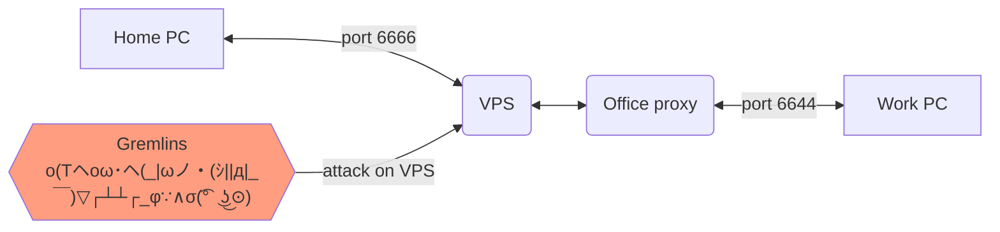

# HopBit — There and Back Again

This guide describes how to set up an SSH tunnel between two computers via an external gateway.
A basic understanding of the `ssh` command (particularly the `-R` and `-p` options) is sufficient for following this guide.

The `corkscrew` utility is used to bypass internal firewalls that block direct SSH access to a VPS over the standard port 22.
This can be useful in corporate environments where the IT or security department restricts outbound connections.

> **Security note:** For better protection against unauthorized access, configure SSH key‑based authentication and disable password logins. This is not covered in detail here.

---

## Network Layout



**Hosts:**

* **Home PC**

  * `home_ip`
  * `home_user`
* **VPS**

  * `vps_ip`
  * `vps_user`
* **Work PC**

  * `work_ip`
  * `work_user`

**Ports:**

* Random port 1 — **6666**
* Random port 2 — **6644**

---

## Quick Reference

### Tunnel from VPS to Home PC

1. On the Home PC, open a reverse SSH tunnel (keep it running):  
**home@**`ssh -R 6666:localhost:22  vps_user@vps_ip`

2. From the VPS, connect to the Home PC:  
**vps@**`ssh -CX home_user@localhost -p 6666`

### Connect from Work PC to VPS

1. Install **corkscrew** on the Work PC:
    [https://github.com/bryanpkc/corkscrew](https://github.com/bryanpkc/corkscrew)
2. Configure SSH on the Work PC, replacing `INTERNAL_PROXY_IP` and `INTERNAL_PROXY_PORT` with your office proxy details:

    ```sshconfig
    host name_vps
        HostName vps_ip
        Port 443
        User vps_user
        ProxyCommand /usr/local/bin/corkscrew INTERNAL_PROXY_IP INTERNAL_PROXY_PORT %h %p

    host name_home
        HostName localhost
        User home_user
        Port 6666
        ProxyJump name_vps
    ```

3. Connect to the VPS:  
**work@**`ssh -CX name_vps`

### Connect from Work PC to Home PC

1. Ensure the Home PC has the reverse tunnel running:  
**home@**`ssh -R 6666:localhost:22 vps_user@vps_ip`

2. From the Work PC:  
**work@**`ssh -CX name_home`

### Connect from Home PC to Work PC

1. On the Work PC, start a reverse SSH tunnel:  
**work@**`ssh -R 6644:localhost:22 name_vps`

2. From the Home PC:  
**home@**`ssh -CX vps_user@vps_ip`  
**vps@**`ssh -CX work_user@localhost -p 6644`

---

## Detailed Instructions

### 1. Connect to VPS


From the Home PC:  
**home@**`ssh vps_user@vps_ip`

> #### Initial setup on VPS (optional)
>
> Verify that networking, package management, and basic tools are working:
>
> **vps@**`apt update`  
> **vps@**`apt install mc htop`
>
> If your VPS provider gives you only the `root` account:
>
> ```bash
> sudo useradd vps_user
> sudo usermod -aG sudo vps_user
> sudo usermod -aG root vps_user
> ```
>
> Disable direct root login in `/etc/ssh/sshd_config`:
>
> ```text
> PermitRootLogin no
> ```
>
> Restart the SSH service:
>
> ```bash
> sudo service ssh restart
> ```

### 2. Reverse Tunnel from VPS to Home PC


A VPS cannot initiate an SSH connection to a home machine with a private (NAT) IP address.
Instead, the Home PC must establish a reverse tunnel **to the VPS**.

1. Open Remonte tunnel on Home PC (should be running):  
**home@**`ssh -R 6666:localhost:22 vps_user@vps_ip`

2. Connect to Home PC from VPS:  
**vps@**`ssh -CX home_user@localhost -p 6666`

3. Keep the tunnel alive automatically:

***autossh ins't standart util***

**home@**`sudo apt install autossh`  
**home@**`autossh -f -N -R 6666:localhost:22 vps_user@vps_ip`

### 3. Connect from Work PC to VPS


If the office network restricts outbound SSH:

1. Install corkscrew:  
**https://github.com/bryanpkc/corkscrew**  

2. Configure SSH on the Work PC:

    ```sshconfig
    host name_vps
        HostName vps_ip
        Port 443
        User vps_user
        ProxyCommand /usr/local/bin/corkscrew INTERNAL_PROXY_IP INTERNAL_PROXY_PORT %h %p
    ```

3. Connect:  
**work@**`ssh -CX name_vps`

### 4. Connect from Home PC to Work PC


1. On the Work PC:  
   **work@**`ssh -R 6644:localhost:22 name_vps`

2. On the Home PC:  
**home@**`ssh -CX vps_user@vps_ip`  
**vps@**`ssh -CX work_user@localhost -p 6644`

---

## SSH Config Examples

### Home PC

```sshconfig
host name_vps
    HostName vps_ip
    User vps_user

host name_vps_R
    HostName vps_ip
    User vps_user
    RemoteForward 6666 localhost:22

host *
    ForwardX11 yes
    Compression yes
```

### Work PC

```sshconfig
host name_vps
    HostName vps_ip
    Port 443
    User vps_user
    ProxyCommand /usr/local/bin/corkscrew 192.168.172.129 3128 %h %p

host name_vps_R
    HostName vps_ip
    User vps_user
    RemoteForward 6644 localhost:22

host name_home
    HostName localhost
    User home_user
    Port 6666
    ProxyJump name_vps

host *
    ForwardX11 yes
    Compression yes
```

### VPS

```sshconfig
host name_home
    HostName localhost
    User home_user
    Port 6666

host name_work
    HostName localhost
    User work_user
    Port 6644

host *
    ForwardX11 yes
    Compression yes
```

---

## Using `autossh`

```bash
sudo apt install autossh
export AUTOSSH_DEBUG=1
export AUTOSSH_GATETIME=0
export AUTOSSH_PORT=20037
autossh -f -N vps_user@vps_ip -R 6666:127.0.0.1:22
```
